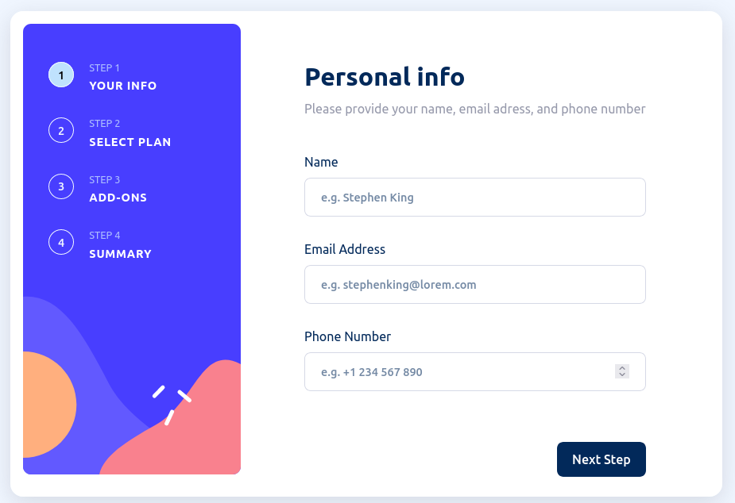
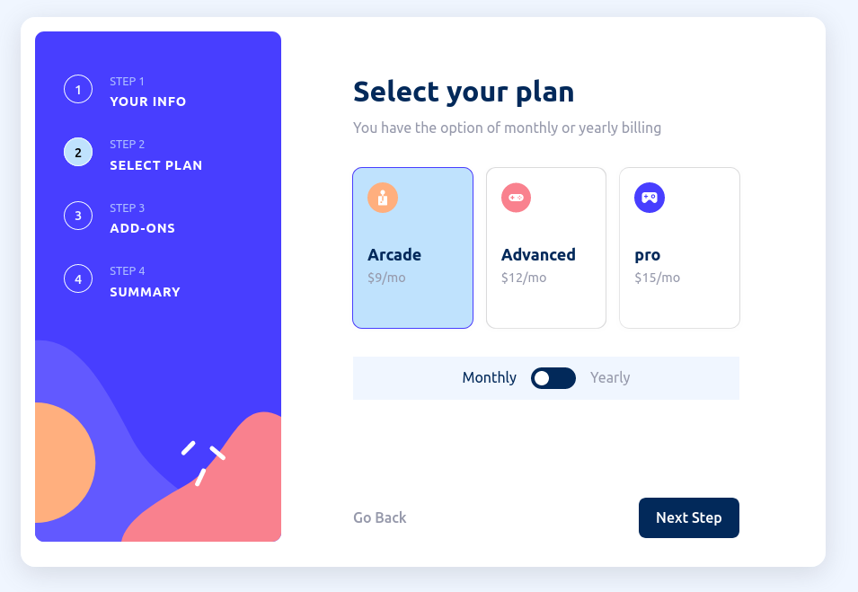
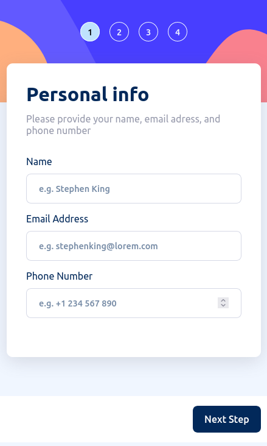
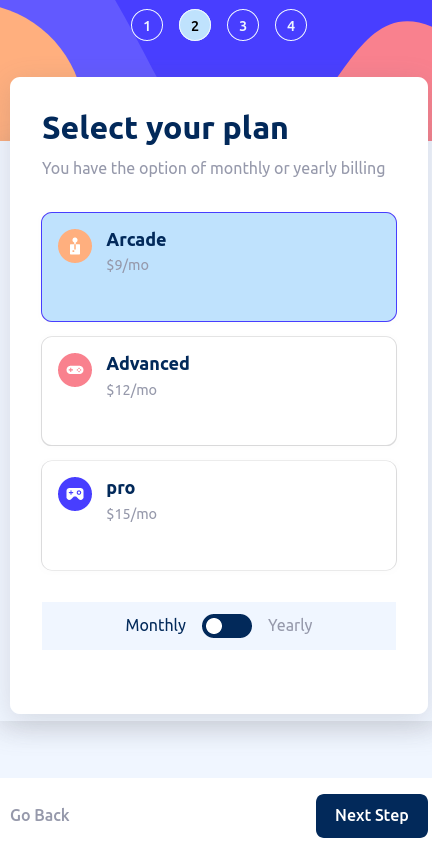

<h1 align="center">MULTI STEP FORM</h1>

- [Overview](#overview)
  - [The challenge](#the-challenge)
  - [Screenshot](#screenshot)
  - [Links](#links)
- [My process](#my-process)
  - [Built with](#built-with)
  - [What I learned](#what-i-learned)
  - [Useful resources](#useful-resources)

**Note: Delete this note and update the table of contents based on what sections you keep.**

## Overview

### The challenge

Users should be able to:

- Complete each step of the sequence
- Go back to a previous step to update their selections
- See a summary of their selections on the final step and confirm their order
- View the optimal layout for the interface depending on their device's screen size
- See hover and focus states for all interactive elements on the page
- Receive form validation messages if:
  - A field has been missed
  - The email address is not formatted correctly
  - A step is submitted, but no selection has been made

### Screenshot

### Desktop




### Mobile




### Links

- Solution URL: [Add solution URL here](https://your-solution-url.com)
- Live Site URL: [Add live site URL here](https://your-live-site-url.com)

## My process

### Built with

- Semantic HTML5 markup
- CSS custom properties
- Flexbox
- CSS Grid
- Mobile-first workflow

### What I learned

- While making this project i learned about grid and flexbox.
- Use Mediaquery to make page responsive
- Use Dom Web API to manupulate webpage when user interact

To see how you can add code snippets, see below:

### input element type and its attribute

```html
<input
  class="inputfield"
  type="text"
  name="name"
  id="name"
  placeholder="e.g. Stephen King"
/>
```

### example to how to style input element

```css
input {
  width: 100%;
  padding: 14px 20px;
  border: 1px solid var(--neutral-light-gray);
  border-radius: 0.5rem;
  outline: none;
  transition: border 0.5s;
  color: var(--primary-marine-blue);
  font-weight: 600;
  font-size: 1rem;
}
input:focus {
  border: 1px solid var(--primary-purplish-blue);
}
input::placeholder {
  font-weight: 500;
  font-size: 0.9rem;
}
```

### example of creating dom element in JS

```js
function planFinished(element) {
  selectedPlanContainer.innerHTML = "";
  const div = document.createElement("div");
  const h1 = document.createElement("h1");
  h1.innerText = `${element.id} (${element.dataset.duration})`;
  const h2 = document.createElement("h2");
  h2.setAttribute("class", "change");
  h2.innerText = "Change";
  div.append(h1);
  div.append(h2);
  const h3 = document.createElement("h3");
  h3.setAttribute("class", "plan_price");
  h3.innerText = `$${element.dataset.price}/${element.dataset.duration.slice(
    0,
    2
  )}`;
  selectedPlanContainer.append(div);
  selectedPlanContainer.append(h3);
};
```

### Useful resources

- [W3schools](https://www.w3schools.com/cssref/css3_pr_mediaquery.php) - This helped me for writing mediaquery. I really liked this pattern and will use it going forward.
- [Mdn](https://developer.mozilla.org/en-US/docs/Glossary/DOM) - This is an amazing article which helped me understand DOM API. I'd recommend it to anyone still learning this concept.
